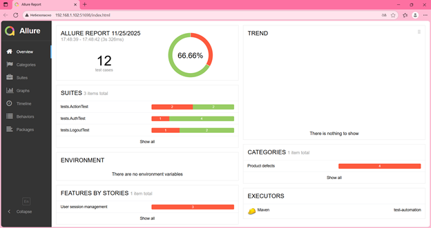
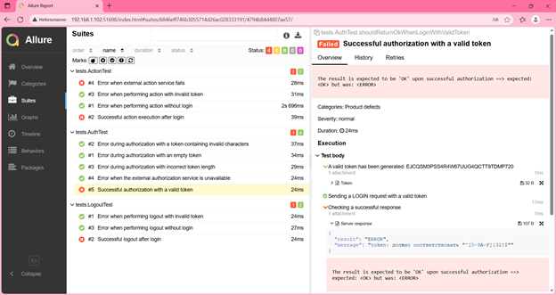
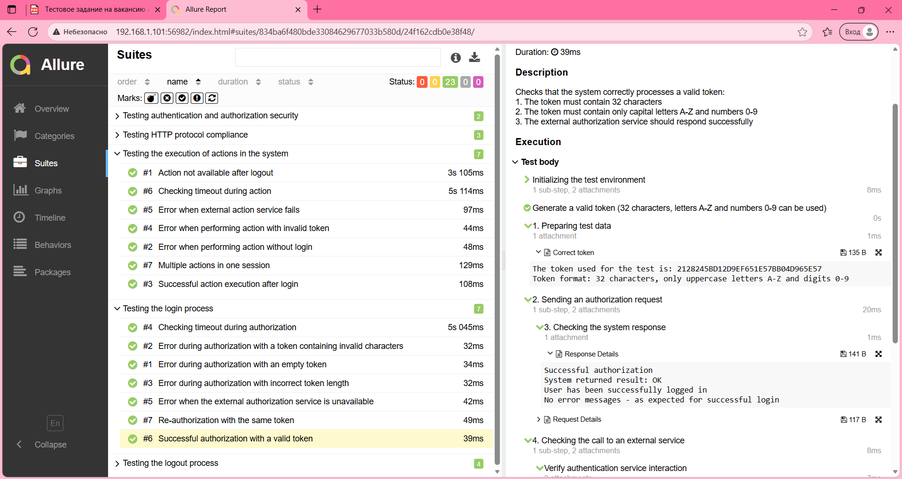

# Тестовое задание: Автоматизация тестирования

## Запуск тестов

### 1. Запустите тестируемое приложение:
```bash
java -jar -Dsecret=qazWSXedc -Dmock=http://localhost:8888/ internal-0.0.1-SNAPSHOT.jar
```
### 2. Запустите тесты:
```bash
mvn clean test
```

### 3. Сгенерируйте отчет Allure:
```bash
mvn allure:serve
```

## Обнаруженная особенность
В документации указано, что токен должен состоять из символов A-Z0-9, но фактически приложение принимает только ограниченный набор символов A-F0-9.

## Скриншоты отчетов

### Главная страница отчета


### Неуспешная авторизация (с полным набором символов по документации A-Z0-9)


### Тесты при успешной авторизации (с ограниченным набором символов A-F0-9)


